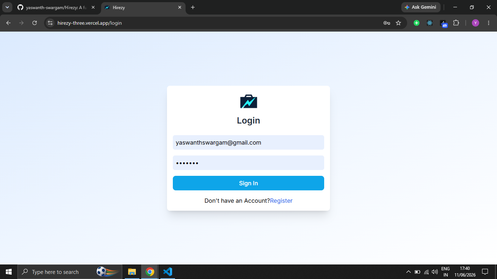
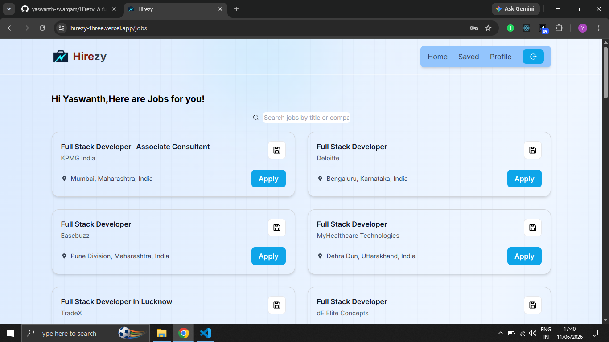
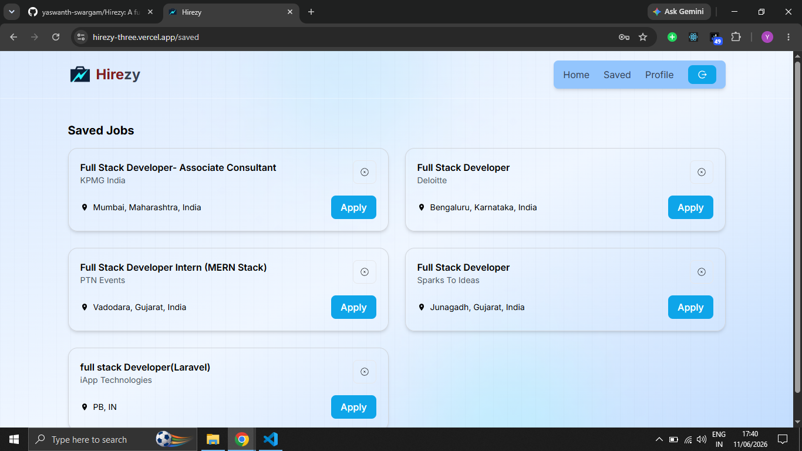
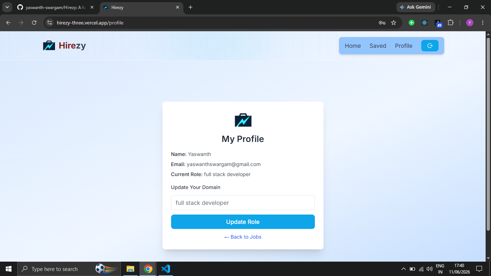

# Hirezy — Full Stack Job Portal

A job portal that scrapes real listings from LinkedIn and Indeed, matches them to a user's domain, and lets users save jobs they're interested in. Built with React, Node.js, Express, and MySQL. Deployed on Vercel and Railway.

🔗 **Live:** [hirezy-three.vercel.app](https://hirezy-three.vercel.app)

---

## Screenshots






---

## What it does

- Users register with a role (e.g. "full stack developer", "data analyst")
- Jobs scraped from LinkedIn and Indeed via a Python ETL pipeline are stored in MySQL
- On login, the app shows jobs filtered by the user's role
- Users can save jobs, remove them, and update their role from the Profile page
- Role change reflects immediately — jobs refetch from the database without a page reload

---

## Tech Stack

**Frontend**
- React 18, Redux Toolkit, React Router
- Tailwind CSS
- Axios with `withCredentials` for cookie-based requests

**Backend**
- Node.js, Express.js
- MySQL with mysql2
- JWT stored in httpOnly cookies (not localStorage)
- bcrypt for password hashing
- Role-based access control on protected routes

**ETL**
- Python, pandas, SQLAlchemy, jobspy
- Scrapes LinkedIn and Indeed, transforms and deduplicates records, loads into MySQL
- Runs locally and pushes directly to Railway MySQL

**Testing**
- Jest and Supertest — 20 integration tests across auth, jobs, and saved-jobs modules
- Tests cover: HTTP status codes, JWT cookie auth, token expiry, duplicate-entry handling, role-based access, and unauthorized request rejection

**Deployment**
- Frontend → Vercel
- Backend + MySQL → Railway
- Auto-deploys on every push to `main`

---

## Project Structure

```
Hirezy/
├── Backend/
│   ├── src/
│   │   ├── config/        # DB connection
│   │   ├── controllers/   # auth, jobs, savedJobs, user
│   │   ├── middlewares/   # JWT cookie verification
│   │   ├── routes/        # auth, jobs, savedJobs, user
│   │   └── tests/         # Jest + Supertest test files
│   ├── server.js
│   └── .env               # not committed
├── Frontend/
│   ├── src/
│   │   ├── api/           # axios instance
│   │   ├── Components/    # Navbar, JobCard, MenuComp etc.
│   │   ├── pages/         # Jobs, SavedJobs, Login, SignUp, Profile
│   │   ├── routes/        # ProtectedRoute
│   │   ├── store/         # Redux slices and actions
│   │   └── layouts/       # MainLayout
│   └── vercel.json        # proxy config
└── ETL/
    ├── etl.py
    ├── .env               # not committed
    └── requirements.txt
```

---

## Running Locally

**Prerequisites:** Node.js, Python 3, MySQL

**Backend**
```bash
cd Backend
npm install
# create .env with DB_HOST, DB_USER, DB_PASSWORD, DB_NAME, JWT_SECRET_KEY, PORT
npm run dev
```

**Frontend**
```bash
cd Frontend
npm install
# set baseURL in src/api/axios.js to http://localhost:3000/api
npm run dev
```

**ETL**
```bash
cd ETL
pip install -r requirements.txt
# create .env with DB credentials pointing to your local MySQL
python etl.py
```

**Tests**
```bash
cd Backend
# create .env.test with local DB credentials
npm test
```

---

## API Endpoints

| Method | Route | Auth | Description |
|---|---|---|---|
| POST | `/api/auth/register` | No | Register new user |
| POST | `/api/auth/login` | No | Login and set JWT cookie |
| POST | `/api/auth/logout` | No | Clear JWT cookie |
| GET | `/api/auth/verify` | Yes | Verify cookie and return user |
| GET | `/api/users/me` | Yes | Get current user profile |
| PUT | `/api/users/update-role` | Yes | Update user role |
| GET | `/api/jobs` | Yes | Get jobs filtered by user role |
| GET | `/api/saved-jobs` | Yes | Get saved jobs |
| POST | `/api/saved-jobs/:jobId` | Yes | Save a job |
| DELETE | `/api/saved-jobs/:jobId` | Yes | Remove a saved job |

---

## Test Coverage

```
auth.test.js     — register, login, verify, logout (9 tests)
jobs.test.js     — authenticated access, unauthorized access (2 tests)  
savedJobs.test.js — save, duplicate save, fetch, remove, unauthorized (9 tests)
─────────────────────────────────────────────
Total: 20 tests — all passing
```

---

## Author

**Yaswanth Swargam**
B.Tech CSE — RGUKT Ongole (2027)

[LinkedIn](https://www.linkedin.com/in/yaswanth-swargam/) · [GitHub](https://github.com/yaswanth-swargam/)
